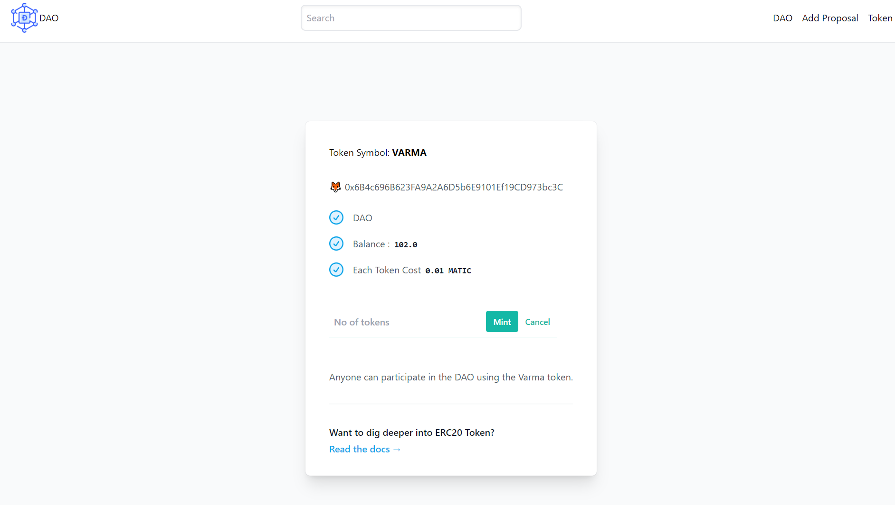

# DAO

<p align="justify">
Any Members can create a Proposal and all other members can vote on it.
each Proposal created has a deadline for voting and after all the deadline
decision is made in favour of the voting outcome.
</p>
<br/>
<br/>
## Installation

```bash
cd dao-dapp/
yarn install
yarn run dev
```

## Contract Deployed At
[ERC20 Contract Address: 0xa9E8dde0109F31504CfA37994D13f6189e5D9ad5](https://mumbai.polygonscan.com/address/0xa9E8dde0109F31504CfA37994D13f6189e5D9ad5)
[DAO Contract Address: 0xFe8E2e3E07224170eB9E0CEfa1da2c4C5D63d50C](https://mumbai.polygonscan.com/address/0xFe8E2e3E07224170eB9E0CEfa1da2c4C5D63d50C)


<br/>
<br/>
<ol>
    <li>
        <b>ERC20</b>
        <p>
            ERC20 is used as a voting token for decentralised autonomous organisations ( DAO ). We can mint tokens as shown in the pic below. where users can login through MetaMask Wallet and Mint Tokens.
        </p>
    </li>
    
    
<li>
    <b>DAO accepts ERC20 token deposits.</b>
    <p>
     To add a proposal, users need to have a minimum of 10 VARMA ERC20 Tokens. To add any new proposals Initially, users need to deposit ERC20 tokens into the DAO Smartcontract.
This will be done in two steps.
    <ol>
        <li>Approve (ERC20)</li>
        <li>transferFrom (ERC20, DAO Contract deposit function )</li>
    </ol>
</p>
</li>
    

<li>
    <b>Add Proposals</b>
    <p>A user can add proposals if they have a minimum amount of 10 VARMA ERC20 Tokens.</p>
</li>
    

<li>
    <b>DAO</b>
    <p>Users can upvote and downvote. The time limit for ending a proposal is seven days.</p>
</li>
    
</ol>

